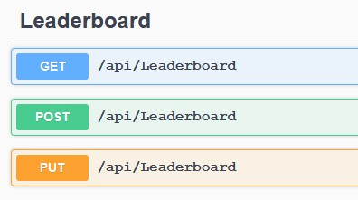

# Backend Architecture

Backend architecture is based on the [Clean Architecture](https://docs.microsoft.com/en-us/dotnet/architecture/modern-web-apps-azure/common-web-application-architectures#clean-architecture). There are four projects in the solution to
handle the architecture: API, Application, Domain and Infrastructure project.

**API project** is based on .NET 6.0. It is the UI layer and is the entry point for the application. I’ve tried to
keep API project as thin as possible, for it doesn’t handle business logic. I’ve used `swagger` to simplify
API test and development. For API security, I’ve used JWT authenticatio. So before running the project
be sure to use proper port number for JWT, I’ve used `44386` port number in `Startup.cs` and
`AuthController.cs` files to configure JWT.

**Application Project** is based on .NET Standard 2.1. This project contains the main business logic
abstractions. This project includes abstractions for operations that will be performed using
Infrastructure.

**Infrastructure Project** is based on .NET Standard 2.1. The Infrastructure project typically includes data
access implementations include the Entity Framework (EF) DbContext, any EF Core Migration objects
that have been defined, and data access implementation classes. The Infrastructure project should also
contain implementations of abstractions defined in the Application project.

**Domain Project** is based on .NET Standard 2.1, and includes business Entity models and DTOs.

**Design Patterns** : Unit of work, Generic Repository Pattern

***

# Running the Backend Project

To run the backend project, you have to first try to generate the database, so in visual studio, you need
to select `API` project as the startup project, then through the package manager console, select the
`Infrastructure` project as the default project, and then run `Update-Database` command.

Make sure database is created in the SQL Server’s `LocalDb` , and try to run the project preferably with IIS
Express. There is a seed method in the `Program.cs` to seed the database after the first run, It’ll insert lots

of data into the tables. After database is seeded, you can try the API with swagger to see the data. There
are lots of users created in the database after the seed that their password is `654321` , so you can login
with swagger to call API functions.

In order to login, use this api:

After login, you’ll get a token, copy it and click on the Authorize button on the top of the page.

After this, you can freely test the API and fetch/post data from/into different tables.

The API

* Allows race times to be posted to the leaderboard given the logged in user ID, a race ID, and a
race time in milliseconds.
* Allows the logged in user to improve on its existing time.
* Offers a means of retrieving the leaderboard entries for a specific race ID, ordered by time
ascending, for display on a website or in-game.

***
# Running the Client Project

I’ve used Angular 8 framework for [the client application](https://github.com/masoudarvishian/game-leaderboards-client). There’s nothing special about the
client, I’ve used `auth guard`, `interceptor` and different `components`, `models`, `services` to interact with the
server side.

In order to run the client, open the `constants.ts` file and make sure `BASE_URL` value is sync with server
address. After that, just run `npm install` command in the root of the project, and then run `ng serve`
command to run the project on port `4200`.

Then you can work with client and see the leaderboard and other related stuff. 

Here is the picture leaderboard page:

